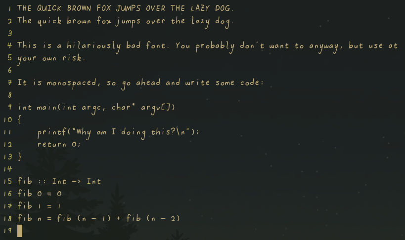

# badfont

A project by me using my scanned handwriting to make terrible UI choices.

## Why?

Why not?

## Inconsistencies in the `*.png`s

I have been changing up specs and workflows through out working through the
alphabet. Please don't kill me.

## Usage

Download the font from the Releases page and... well, install it the way it
works for your system. If on Linux, usually `cp badfont.ttf ~/.fonts` works.

Line spacing is currently wonky, for example on gnome-terminal set cell height
to 1.45x to avoid issues.

## Workflow

This font was made by writing on a piece of paper that was then scanned, before
tracing in GIMP using a tablet. The resultant traces (seen in `traces/*.png`
were imported into FontForge and autotraced using potrace.

**NOTE**: I swear my handwriting isn't usually this bad, it's the flawed
workflow that makes it look this bad. Really...

## Disclaimer

Has errors. Does not have many characters. Is inconsistent. Don't use it.

